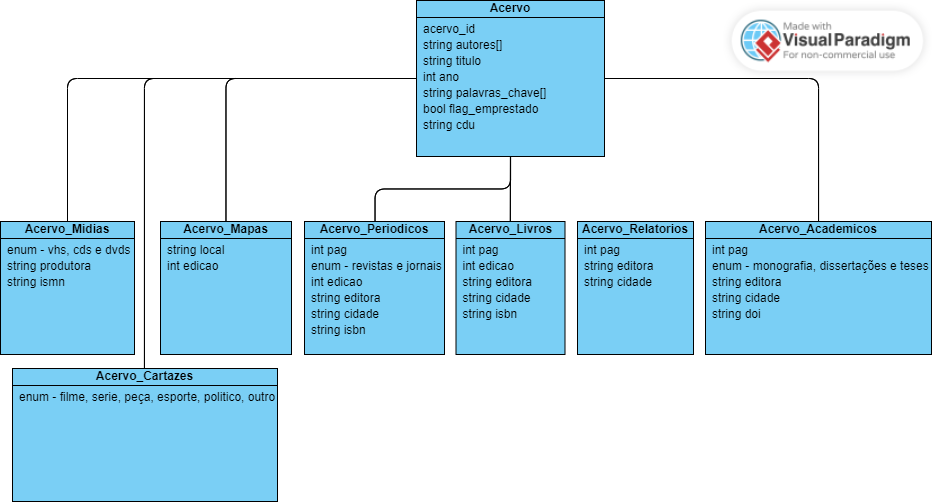

# Biblioteca Universitária - Acervo

## Sobre o Projeto
Este projeto visa o desenvolvimento de um sistema de gerenciamento de acervo para uma biblioteca universitária. O sistema é implementado em Java utilizando Maven como gerenciador de dependências. Ele permite o cadastro, manutenção, empréstimo e consulta de itens do acervo, que incluem livros, periódicos, trabalhos acadêmicos, relatórios, mídias, cartazes e mapas.

## Membros do Grupo
- Caio Cezar Dias
- Isabely Toledo de Melo
- Thaissa Fernandes
- Luis Felippe
- Maicon Fernandes

## Estrutura do Repositório
O repositório está estruturado da seguinte maneira:
- `src/main/java`: Contém o código-fonte do projeto.
- `pom.xml`: Arquivo de configuração do Maven, que gerencia as dependências e outras diretivas de construção do projeto.

## Modelo de Classes
O sistema é baseado em uma hierarquia de classes que representam os diferentes tipos de itens do acervo. Cada classe de item suporta operações básicas de CRUD (Create, Read, Update, Delete), empréstimo e pesquisa de informações.



## Funcionalidades
- **Cadastro de Itens**: Permite adicionar novos itens ao acervo.
- **Manutenção de Itens**: Suporta a atualização e remoção de itens existentes.
- **Empréstimo de Itens**: Funcionalidade para registrar o empréstimo de itens a usuários.
- **Consulta de Itens**: Permite pesquisar itens no acervo com base em critérios específicos, exibindo a ficha catalográfica.

## Como Executar
### Pré-requisitos
- Java JDK 11 ou superior.
- Maven para gerenciamento de dependências e construção do projeto.

### Instruções
1. Clone o repositório:
   ```
   git clone https://github.com/caiocdias/biblioteca_universitaria.git
   ```
2. Navegue até o diretório do projeto e execute:
   ```
   mvn clean install
   ```
3. Para executar o sistema:
   ```
   java -jar target/nome-do-artefato-gerado.jar
   ```